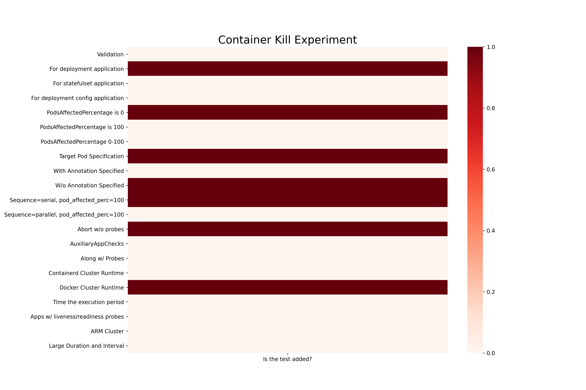
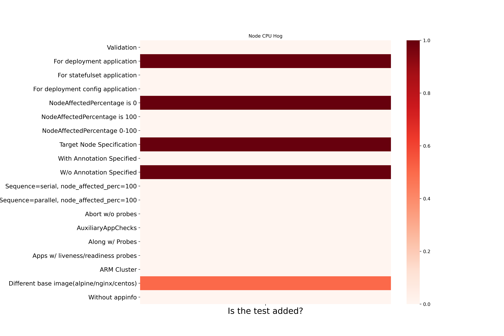
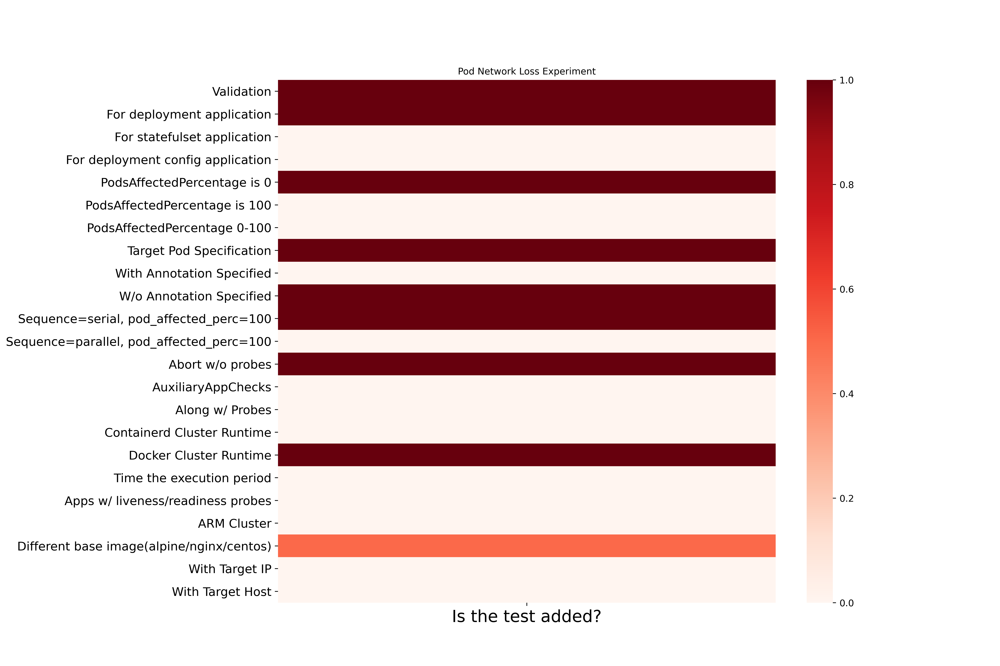
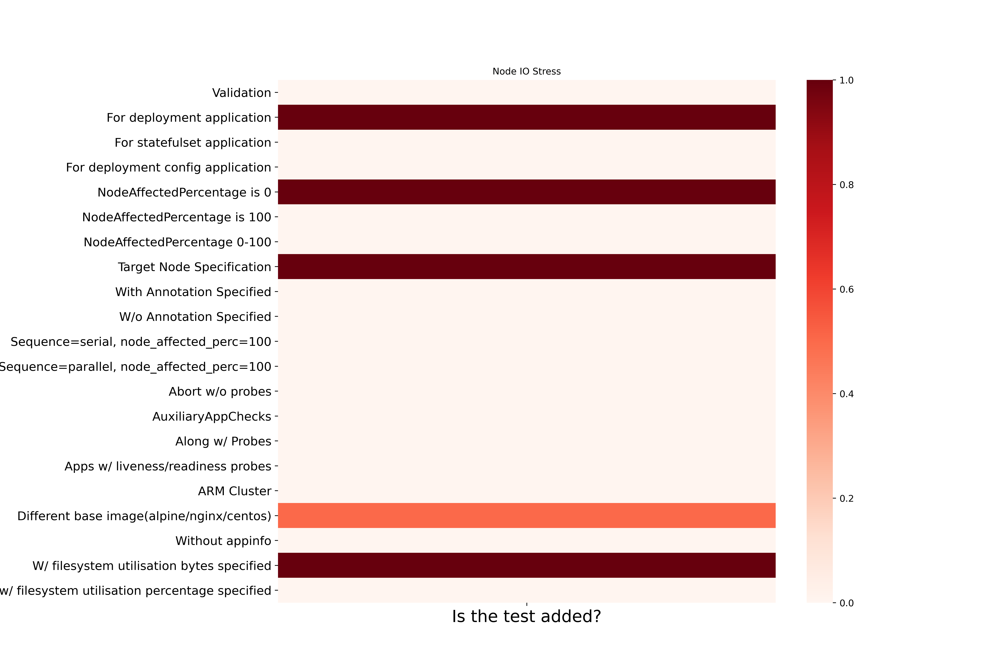

---
title: Heatmap
layout: template
filename: heatmap
--- 

# Coverage Heatmap mertics For LitmusChaos Experiments

The heatmap metrics show the covered and uncovered e2e tests for a particular chaos experiment that helps in gaining stability per experiment. You can create an issue/PR in litmus-e2e [repo](https://github.com/litmuschaos/litmus-e2e/issues) for any suggestion, addition, and improvement of current tests.

## Pod Delete Chaos

## Container Kill Chaos

## Disk Fill Chaos

## Pod CPU Hog

## Pod Memory Hog

## Node CPU Hog

## Node Memory Hog

## Pod Netowork Corruption

## Pod Netowork Duplication

## Pod Netowork Latency

## Pod Netowork Loss

## Kubelet Service Kill

## Node Drain

## Node Taint

## Pod Autoscaler

## Pod IO Stress

## Node IO Stress

