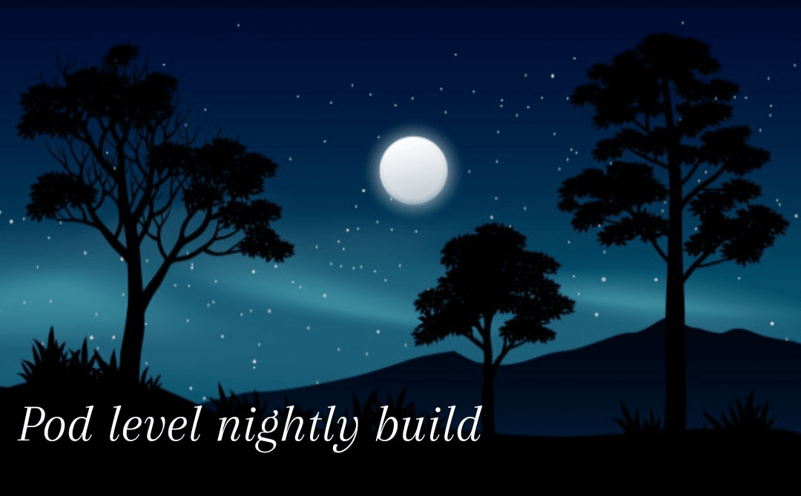

# **Litmus-Portal E2E Pipeline Execution Details**

**Latest Pipeline Status**

# **Pipeline Jobs**

### **Auth,Teaming and User-Management Tests**

- [TCID-EKS-Portal-GUI-AccountSettings](https://github.com/Jonsy13/litmus-e2e/blob/gh-pages/testcases/TCID-EKS-Portal-GUI-AccountSettings.md)
- [TCID-EKS-Portal-GUI-Auth](https://github.com/Jonsy13/litmus-e2e/blob/litmus-portal/gh-pages/TCID-EKS-Portal-GUI-Auth.md)
- [TCID-EKS-Portal-GUI-Routes](https://github.com/Jonsy13/litmus-e2e/blob/litmus-portal/gh-pages/TCID-EKS-Portal-GUI-Routes.md)
- [TCID-EKS-Portal-GUI-Teaming](https://github.com/Jonsy13/litmus-e2e/blob/litmus-portal/gh-pages/TCID-EKS-Portal-GUI-Teaming.md)
- [TCID-EKS-Portal-GUI-User-Management](https://github.com/Jonsy13/litmus-e2e/blob/litmus-portal/gh-pages/TCID-EKS-Portal-GUI-User-Management.md)

## Daily Nightly Builds

<table  cellpadding="5">

  <tr>
      <td>
      <a href="pipeline-runs/portal-run.html">
      
       
      <b>Litmus-Portal Nightly Build</b>
      </a>
      </td>
  </tr>

</table>

## Release Candidate(RC) Build

<table  cellpadding="5">

  <tr>
      <td>
      <a href="pipeline-runs/portal-rc.html">
      
       
      <b>Litmus-Portal RC Build</b>
      </a>
      </td>
  </tr>

</table>

## General Availability(GA) Build

<table  cellpadding="5">

  <tr>
      <td>
      <a href="pipeline-runs/portal-ga.html">
      
       
      <b>Litmus-Portal GA Build</b>
      </a>
      </td>
  </tr>

</table>
